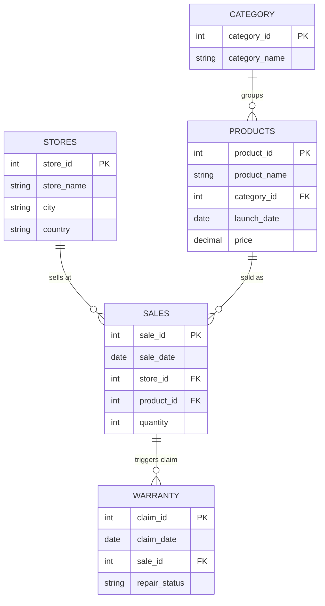

# 📊 Apple Retail Sales Analysis — SQL Portfolio Project

[](#)
[](#)

SQL-based analysis of Apple retail sales data, answering 12 business questions across three areas: sales performance, product lifecycle, and warranty risk — built with a strong emphasis on data quality validation at every stage.

**Data source:** [Apple Retail Sales Dataset](https://www.kaggle.com/datasets/amangarg08/apple-retail-sales-dataset) (Kaggle)

---

## 📑 Table of Contents

- [Key Highlights](#-key-highlights)
- [About This Project](#-about-this-project)
- [Data Schema (ERD)](#️-data-schema)
- [SQL Techniques Used](#-sql-techniques-used)
- [Data Quality Findings Summary](#️-data-quality-findings-summary)
- [Part 1: Sales Performance](#-part-1-financial-performance--market-behavior-sales-performance)
- [Part 2: Product Lifecycle](#-part-2-product-strategy--lifecycle)
- [Part 3: Warranty/Risk Evaluation](#️-part-3-risk--quality-control-evaluation-warrantyrisk-evaluation)
- [Key Conclusions](#-key-conclusions)
- [How to Run](#️-how-to-run)
- [Contact](#-contact)

---

## 📸 Key Highlights

<p align="center">
  
  
</p>

---

## 📌 About This Project

**Objective:** To answer business questions relevant to three different stakeholder groups — management (sales performance), the product team (product lifecycle), and the quality assurance team (warranty risk evaluation) — while demonstrating an end-to-end analytical process: from query writing and result validation to anomaly/bug detection and finding-driven revisions.

<details>
<summary><strong>📁 Repo Structure</strong> (click to expand)</summary>

```
apple-retail-sql-data-quality-analysis/
├── README.md
├── LICENSE
├── .gitignore
├── assets/
│   ├── total_revenue_by_category_product.png
│   └── global_monthly_sales.png
├── queries/
│   ├── 01_setup_database.sql
│   ├── 02_create_tables.sql
│   ├── 03_import_data.sql
│   ├── 04_verify_data.sql
│   ├── 05_data_cleaning.sql
│   ├── 06_analysis_sales.sql
│   ├── 07_product_lifecycle.sql
│   └── 08_warranty_analysis.sql
└── results/
    ├── revenue_by_category.csv
    ├── monthly_trend_global.csv
    ├── declining_stores.csv
    ├── product_cannibalization.csv
    └── launch_batch_quality.csv
```

Each `.sql` file in `queries/` contains multiple queries separated by section comments (e.g. `-- Analysis 1a`). Files `01-05` cover setup, import, and initial data cleaning before the analysis stage (`06-08`).

</details>

---

## 🗃️ Data Schema



---

## 🧩 SQL Techniques Used

| Category | Techniques |
|---|---|
| **Window Functions** | `LAG()` (YoY analysis, store trends), `RANK()` (ranking months/products/stores), windowed aggregation (`SUM() OVER`) |
| **CTEs (Common Table Expressions)** | Multi-level CTEs to break down complex logic (e.g. 4-5 layered CTEs in the product cannibalization analysis) |
| **Joins** | `INNER JOIN`, `LEFT JOIN`, self-join (duplicate store detection & deduplication) |
| **Aggregate Functions** | `SUM`, `AVG`, `COUNT`, `PERCENTILE_CONT` (median) |
| **Conditional Logic** | `CASE WHEN` for categorization (product cohorts, premium classification) |
| **Date Arithmetic** | Date difference calculations, conversion to absolute month for time-series comparison |
| **Data Validation** | Diagnostic queries to detect anomalies (invalid data proportions, duplicate entries) before running the main analysis |

---

## ⚠️ Data Quality Findings Summary

| Finding | Scale | Affected Section |
|---|---|---|
| 2024 data only available through November 12 (partial year) | — | Sales |
| Sales transactions with `sale_date` earlier than the product's `launch_date` | 47.41% of all transactions | Product Lifecycle |
| Warranty claims with `claim_date` earlier than `sale_date` | 8.96% of all claims | Warranty |
| Warranty claims on non-physical categories (Subscription/Streaming) | 11.05% of all claims | Warranty |
| Duplicate store entries (identical name/city/country, different `store_id`) | 6 out of 75 store entries | Sales, Warranty |

Each finding was validated with a diagnostic query (measuring its scale/proportion) before deciding how to handle it — exclusion, normalization, or documentation as a limitation. Two **query bugs** (an incorrect join condition and a case-mismatch filter) were also found in the Warranty section and have been fixed. Full details are available in each respective section below.

---

## 📊 Part 1: Financial Performance & Market Behavior (Sales Performance)

| Question | Short Answer |
|---|---|
| Which category is growing the fastest? | None stands out; all categories are relatively stable (growth -0.31% to +0.85%) |
| Which month has peak global sales? | March (highest), February (lowest); seasonality is not extreme |
| Does the seasonal pattern differ by hemisphere? | Inconclusive — data representation is unbalanced (only 1 Southern Hemisphere country) |
| Which stores show a declining trend? | 26 of 75 stores (34.7%) — a systemic pattern, not isolated cases |
| Is there a geographic premium price preference? | No correlation — uniform across all countries (~52-53%) |

<details>
<summary><strong>See full methodology & insights (4 questions)</strong></summary>

### ⚠️ Data Quality Note for This Section
> The `sales` table only contains 2024 data through November 12, 2024 (not a full year). This was discovered when every product category showed a uniform revenue decline (~-12% to -13%) in 2024 — a pattern too consistent to be an organic business trend. **Handling:** 2024 revenue was *annualized* for the year-over-year growth analysis, and fully *excluded* from the monthly seasonality analysis.

### 1️⃣ Category Revenue Estimation
**Query:** [`06_analysis_sales.sql`](./queries/06_analysis_sales.sql) — sections `-- Analysis 1a`, `-- Analysis 1b`

**Methodology:** Revenue = `quantity × price` (current price). YoY growth calculated with `LAG()`; 2024 revenue annualized.

**Findings:** Highest revenue: Tablet ($953M), Accessories ($927M), Smartphone ($865M); lowest: Smart Speaker ($96M). After correction, all categories show flat growth (-0.31% to +0.85%/year). The category with the highest growth rate (Smart Speaker) actually has the smallest revenue — a classic *small base effect*.

**Insight:** No clear "growth star" category exists. Growth rate needs to be read alongside absolute revenue scale.

### 2️⃣ Global Seasonal Trend
**Query:** [`06_analysis_sales.sql`](./queries/06_analysis_sales.sql) — sections `-- Analysis 2a`, `-- Analysis 2b`

**Methodology:** 2024 data excluded so months are compared across an equal number of full years.

**Findings:** March is highest and February lowest globally, but the spread is narrow (~11%). At the country level, the seasonal pattern is much weaker: the "peak" month in each country only contributes 8.5–8.8% of the annual total (a perfectly even baseline would be 8.33%) — most of the country-level seasonal signal is noise. The hemisphere comparison isn't statistically valid (Australia is the only Southern Hemisphere representative, n=1 vs n=19).

**Insight:** The clear global seasonal pattern "disappears" when broken down by country because per-country volume is too small to detect a reliable signal. Seasonal strategy should be based on aggregate global/regional data rather than individual countries.

### 3️⃣ Critical Store Performance
**Query:** [`06_analysis_sales.sql`](./queries/06_analysis_sales.sql) — sections `-- Analysis 3`, `-- Analysis 3b`

**Methodology:** `LAG()` partitioned by `store_id` (not `store_name`), with 2024 excluded. The proportion of stores meeting the criteria was validated against the total store count.

**Findings:** 26 of 75 unique stores (34.7%) declined for two consecutive years, with a small magnitude (~3-5%/year) but a large proportion — a widespread pattern, not isolated cases.

**Insight:** This is likely a systemic factor (market saturation, a shift to online channels) rather than an individual store operational issue. Further investigation at the category/channel level is warranted.

> ⚠️ **Additional note:** It was later discovered that 6 stores in the `stores` table are duplicated, meaning the 75 `store_id`s actually represent only 69 unique physical stores. The 34.7% figure was calculated before deduplication; it may shift slightly but is unlikely to change the overall conclusion.

### 4️⃣ Geographic Price Preference
**Query:** [`06_analysis_sales.sql`](./queries/06_analysis_sales.sql) — section `-- Analysis 4`

**Methodology:** A product is "premium" if priced above the global average. Percentage of premium transactions calculated per country.

**Findings:** No significant correlation found — all 20 countries fall within a narrow 52.29%–53.11% range (<1 percentage point spread).

**Insight:** A valid *null finding* — there's no basis for country-differentiated pricing strategy based on this data.

</details>

---

## 🚀 Part 2: Product Strategy & Lifecycle

| Question | Short Answer |
|---|---|
| Dependency on new products (2023)? | Low — 86.94% of revenue from legacy products, 13.06% from new products |
| Product adoption speed? | Median of 11 months to peak sales; right-skewed distribution |
| Product cannibalization? | Present, largest for Apple TV+, AirPods Pro, iPhone 14 Pro Max — a robust finding |
| Localized product failures? | Yes, several products show sharp contrasts between countries (e.g. AirPods Pro) |

<details>
<summary><strong>See full methodology & insights (4 questions)</strong></summary>

### ⚠️ Critical Finding: Data Anomaly in `launch_date`
> **47.41% of all sales transactions** (493,143 of 1,040,200 rows) have a `sale_date` earlier than the product's `launch_date` — logically impossible. This was detected when 34.8% of "peak sales month" results showed a negative `months_to_peak`. Likely a characteristic of the synthetic dataset (the `sales` and `products` tables appear to have been generated independently). **Handling:** invalid transactions were excluded from Analyses 5, 6, and 7.

### 5️⃣ New Product Dependency
**Query:** [`07_product_lifecycle.sql`](./queries/07_product_lifecycle.sql) — section `-- Analysis 5`

**Methodology:** 2023 transactions grouped into New (launch_year = 2023) vs. Legacy, after excluding invalid transactions.

**Findings:** Legacy 86.94%, New 13.06% of 2023 revenue *(before correction: 81.30%/18.70% — a significant shift after excluding the 25.45% of 2023 revenue that came from invalid transactions)*.

**Insight:** The company is not heavily reliant on new products; 87% of revenue still comes from legacy products.

### 6️⃣ Adoption Speed
**Query:** [`07_product_lifecycle.sql`](./queries/07_product_lifecycle.sql) — sections `-- Analysis 6a`, `-- Analysis 6b`

**Methodology:** In addition to excluding invalid transactions, products launched less than 6 months before the data cutoff (Nov 12, 2024) were also excluded to avoid *right-censoring bias*.

**Findings:** Median of 11 months to peak sales; average of 16.9 months (higher — indicating a right-skewed distribution, range of 1–56 months).

**Insight:** Use the median as the primary reference. A small subset of products (likely accessories/software) take much longer — worth further investigation.

### 7️⃣ Product Cannibalization
**Query:** [`07_product_lifecycle.sql`](./queries/07_product_lifecycle.sql) — section `-- Analysis 7`

**Methodology:** Compares sales of legacy products (same category) one month before vs. one month after a new product's launch.

**Findings:** Largest cannibalization: Apple TV+ (-100%), AirPods Pro (-62.24%), iPhone 14 Pro Max (-62.19%). The finding is **robust** — nearly identical before and after excluding invalid data.

**Insight:** Premium product lines (AirPods Pro, iPhone Pro Max) significantly cannibalize their predecessors — a pattern consistent with Apple's typical product strategy.

### 8️⃣ Localized Product Failures
**Query:** [`07_product_lifecycle.sql`](./queries/07_product_lifecycle.sql) — section `-- Analysis 8`

**Methodology:** Finds products ranked top-5 in one country but bottom-10 in another. Not affected by the `launch_date` issue.

**Findings:** AirPods Pro (top-5 in Colombia & Thailand, bottom-10 in China/Italy/Austria), AirPods 2nd Gen (top-3 in Italy, bottom in UK/UAE), among others.

**Insight:** Product preference is highly localized — a uniform global marketing/inventory strategy risks being suboptimal.

</details>

---

## 🛡️ Part 3: Risk & Quality Control Evaluation (Warranty/Risk Evaluation)

| Question | Short Answer |
|---|---|
| Time to warranty claim? | ~800 days on average, uniform across physical categories |
| Any store-level anomalies? | No extreme outliers; ratios range 0.40-0.54%, gradual variation |
| Products with the highest repair cost burden? | Beats Fit Pro, iMac 27-inch, iPad mini (5th Gen) |
| Launch batch quality, early vs. later? | Claim ratio is slightly higher in the first 30 days (2.59% vs 2.39%) |

<details>
<summary><strong>See full methodology & insights (4 questions)</strong></summary>

### ⚠️ Data Quality Findings for This Section
1. **Claims before purchase date:** 8.96% of claims (2,687/30,000) — excluded.
2. **Claims on non-physical categories** (Subscription Service, Streaming Device): 11.05% of claims (3,314/30,000) — excluded from Analyses 9 & 11.
3. **Duplicate store entries:** 6 stores with identical name/city/country but different `store_id` — 75 entries actually represent 69 unique physical stores, merged (deduplicated) in Analysis 10.

Two **query bugs** were also found: an incorrect join condition (`s.store_id = s.store_id`, should be `= st.store_id`) in Analysis 10, and a case-mismatch string filter (`'The first 30 days'` vs. `'The First 30 Days'`) in Analysis 12 — both have been fixed.

### 9️⃣ Time-to-Failure
**Query:** [`08_warranty_analysis.sql`](./queries/08_warranty_analysis.sql) — section `-- Analysis 9`

**Methodology:** Average day difference between `sale_date` and `claim_date` per category, excluding invalid claims and non-physical categories.

**Findings:** 797–831 days (~2.2-2.3 years), a narrow spread across categories (~4.2%).

**Insight:** Time to claim is uniform across physical categories; no category stands out as "failing quickly."

### 🔟 Store Anomaly Detection
**Query:** [`08_warranty_analysis.sql`](./queries/08_warranty_analysis.sql) — section `-- Analysis 10`

**Methodology:** Claim-to-units-sold ratio per store, with duplicate stores merged first.

**Findings:** Ratios of 0.40%–0.54% across 69 unique stores. Highest: Apple Kärntner Straße, Austria (0.54%). No extreme outliers.

**Insight:** No store shows a significantly deviant quality/stock-handling issue; variation is smooth and gradual.

### 1️⃣1️⃣ Cost Burden Assessment
**Query:** [`08_warranty_analysis.sql`](./queries/08_warranty_analysis.sql) — section `-- Analysis 11`

**Methodology:** Total free-repair cost (excluding "Warranty Void"/"Paid Repaired"), excluding invalid claims and non-physical categories.

**Findings:** Highest burden: Beats Fit Pro (333 claims, ~$40,600 estimated), iMac 27-inch (319 claims, ~$40,600 estimated), iPad mini 5th Gen (307 claims, ~$39,000 estimated).

**Insight:** Prioritize quality investigation for these product lines — the combination of high claim frequency and high price makes them the largest cost contributors.

### 1️⃣2️⃣ Launch Batch Quality
**Query:** [`08_warranty_analysis.sql`](./queries/08_warranty_analysis.sql) — sections `-- Analysis 12a`, `-- Analysis 12b`

**Methodology:** Compares claim ratio for the first 30 days vs. after 3 months, excluding invalid transactions.

**Findings:** Aggregate: 2.59% (first 30 days) vs. 2.39% (after 3 months). 63 of 83 products (76%) show the same direction. Note: the first-30-days cohort has a small sample size (~200-300 per product) — the aggregate figure is more reliable.

**Insight:** Indication of *early adopter risk* — early batches are slightly more prone to claims, though the gap is moderate rather than dramatic.

</details>

---

## 🎯 Key Conclusions

- **The business is relatively stable** — both revenue growth and price preference across countries are flat, with no signal of explosive growth or sharp market segmentation.
- **Low dependency on new products** — 87% of annual revenue is sustained by legacy products, with a median adoption time of 11 months.
- **Product cannibalization is real and measurable** — premium lines (Pro/Max) significantly cut into their predecessors' sales, a finding that held consistent despite significant anomalies in the raw data.
- **Product preference is highly localized** — several products succeed in one country while failing in another.
- **No store or category shows extreme quality issues**, though there's an indication that newly launched products are somewhat more prone to warranty claims early in their lifecycle.
- **The analysis process involved extensive data validation** — 5 major data quality issues and 2 query bugs were found and validated with diagnostic queries before being addressed.

---

## 📄 Sample Query Results (`results/`)

A few query results are included as supporting evidence for the key findings:

| File | Analysis | Contents |
|---|---|---|
| [`revenue_by_category.csv`](./results/revenue_by_category.csv) | 1a | Total revenue by product category |
| [`monthly_trend_global.csv`](./results/monthly_trend_global.csv) | 2a | Global monthly sales volume trend |
| [`declining_stores.csv`](./results/declining_stores.csv) | 3 | 26 stores with a 2-year consecutive declining trend |
| [`product_cannibalization.csv`](./results/product_cannibalization.csv) | 7 | Full list of products and cannibalization magnitude |
| [`launch_batch_quality.csv`](./results/launch_batch_quality.csv) | 12a | Claim ratio per product, first-30-days vs. 3-month cohort |

---

## 🛠️ How to Run

1. Run `01_setup_database.sql` through `05_data_cleaning.sql` in order to set up the database, create the table schema, import the raw data, verify it, and perform initial cleaning.
2. Run the analysis queries in `06_analysis_sales.sql` → `07_product_lifecycle.sql` → `08_warranty_analysis.sql` in section order.
3. Each analysis file contains multiple queries separated by section comments — run them individually as needed.

---

## 📬 Contact

Open to discussion, feedback, or collaboration opportunities related to this project.

[](https://www.linkedin.com/in/gloryanisveronicalase)
[](mailto:gloryanislase@gmail.com)
