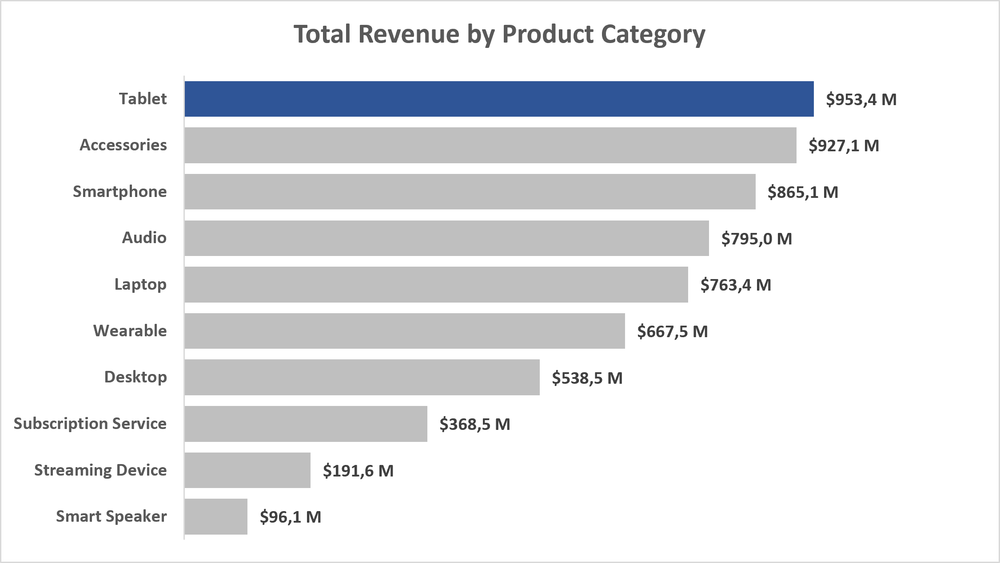
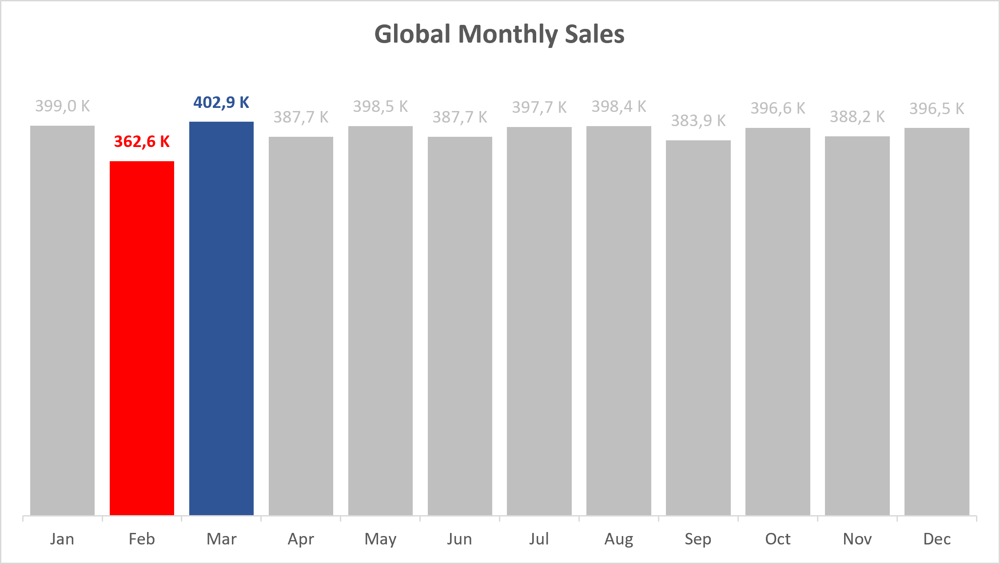

# 📊 Apple Retail Sales Analysis — SQL Portfolio Project


Analisis data penjualan ritel Apple menggunakan SQL untuk menjawab 12 pertanyaan bisnis di tiga area: kinerja penjualan, siklus hidup produk, dan risiko garansi.

**Sumber data:** [Apple Retail Sales Dataset](https://www.kaggle.com/datasets/amangarg08/apple-retail-sales-dataset) (Kaggle)

---

## 📸 Key Highlights

<p align="center">
  
  
</p>

---

## 📌 Tentang Proyek Ini

**Tujuan:** Menjawab pertanyaan bisnis yang relevan bagi tiga pemangku kepentingan berbeda — manajemen (kinerja penjualan), tim produk (siklus hidup produk), dan tim quality assurance (evaluasi risiko garansi) — sekaligus mendemonstrasikan proses analisis data yang menyeluruh: mulai dari penulisan query, validasi hasil, deteksi anomali/bug, hingga revisi berbasis temuan.

<details>
<summary><strong>🗂️ Skema Data</strong> (klik untuk lihat)</summary>

| Tabel | Deskripsi | Kolom Kunci |
|---|---|---|
| `stores` | Informasi toko ritel Apple | `store_id`, `store_name`, `city`, `country` |
| `category` | Kategori produk | `category_id`, `category_name` |
| `products` | Detail produk Apple | `product_id`, `product_name`, `category_id`, `launch_date`, `price` |
| `sales` | Transaksi penjualan | `sale_id`, `sale_date`, `store_id`, `product_id`, `quantity` |
| `warranty` | Klaim garansi | `claim_id`, `claim_date`, `sale_id`, `repair_status` |

</details>

<details>
<summary><strong>📁 Struktur Repo</strong> (klik untuk lihat)</summary>

```
Apple_Retail_Sales_Project/
├── README.md
├── assets/                                # chart untuk README
│   ├── 01_revenue_by_category.png
│   ├── 02_monthly_trend.png
├── queries/
│   ├── 01_setup_database.sql              # Setup database & konfigurasi awal
│   ├── 02_create_tables.sql               # Pembuatan skema tabel
│   ├── 03_import_data.sql                 # Import data mentah
│   ├── 04_verify_data.sql                 # Verifikasi hasil import
│   ├── 05_data_cleaning.sql               # Pembersihan data awal
│   ├── 06_analysis_sales.sql              # Analisis 1-4: Sales Performance
│   ├── 07_product_lifecycle.sql           # Analisis 5-8: Product Lifecycle
│   └── 08_warranty_analysis.sql           # Analisis 9-12: Warranty/Risk Evaluation
└── results/                               # sampel hasil query (bukti pendukung, bukan seluruh output)
    ├── revenue_by_category.csv
    ├── monthly_trend_global.csv
    ├── declining_stores.csv
    ├── product_cannibalization.csv
    └── launch_batch_quality.csv
```

Setiap file `.sql` pada folder `queries/` memuat beberapa query yang dipisahkan komentar section (misal `-- Analysis 1a`), mengikuti urutan pertanyaan bisnis pada bagiannya masing-masing. File `01-05` mencakup tahap setup, import, dan pembersihan data sebelum masuk ke tahap analisis (`06-08`).

</details>

---

## ⚠️ Ringkasan Temuan Data Quality

| Temuan | Skala | Bagian Terdampak |
|---|---|---|
| Data tahun 2024 hanya tersedia sampai 12 November (partial year) | — | Sales |
| Transaksi penjualan dengan `sale_date` sebelum `launch_date` produk | 47.41% dari seluruh transaksi | Product Lifecycle |
| Klaim garansi dengan `claim_date` sebelum `sale_date` | 8.96% dari seluruh klaim | Warranty |
| Klaim garansi pada kategori non-fisik (Subscription/Streaming) | 11.05% dari seluruh klaim | Warranty |
| Duplikasi entri toko (nama/kota/negara identik, `store_id` beda) | 6 dari 75 entri toko | Sales, Warranty |

Setiap temuan divalidasi dengan query diagnostik (menghitung skala/proporsi) sebelum diputuskan cara penanganannya — exclude, normalisasi, atau didokumentasikan sebagai limitation. Ditemukan juga **2 bug pada query** (kondisi join salah & case-mismatch pada filter) di bagian Warranty, sudah diperbaiki. Detail lengkap ada di masing-masing bagian di bawah.

---

## 📊 Bagian 1: Kinerja Keuangan & Perilaku Pasar (Sales Performance)

| Pertanyaan | Jawaban Singkat |
|---|---|
| [Kategori paling pesat tumbuh?](./queries/06_analysis_sales.sql) | Tidak ada yang dominan; semua kategori relatif stabil (growth -0.31% s/d +0.85%) |
| Bulan puncak penjualan global? | Maret (tertinggi), Februari (terendah), musiman tidak ekstrem |
| Beda pola musiman antar hemisphere? | Tidak dapat disimpulkan — representasi data tidak seimbang (1 negara selatan) |
| Toko dengan tren menurun? | 26 dari 75 toko (34.7%) — pola sistemik, bukan kasus terisolasi |
| Preferensi harga premium per negara? | Tidak ada korelasi — seragam di semua negara (~52-53%) |

<details>
<summary><strong>Lihat detail metodologi & insight lengkap (4 pertanyaan)</strong></summary>

### ⚠️ Catatan Data Quality Bagian Ini
> Data tahun 2024 pada tabel `sales` hanya tersedia sampai 12 November 2024 (bukan satu tahun penuh). Ditemukan saat seluruh kategori produk menunjukkan penurunan seragam (~-12% s/d -13%) di 2024 — pola yang terlalu konsisten untuk tren organik. **Penanganan:** revenue 2024 di-*annualized* untuk analisis pertumbuhan tahunan, dan di-*exclude* pada analisis pola musiman bulanan.

### 1️⃣ Estimasi Pendapatan Kategori
**Query:** [`06_analysis_sales.sql`](./queries/06_analysis_sales.sql) — section `-- Analysis 1a`, `-- Analysis 1b`

**Metodologi:** Revenue = `quantity × price` (harga saat ini). Growth YoY dengan `LAG()`, revenue 2024 di-annualized.

**Temuan:** Revenue terbesar: Tablet ($953M), Accessories ($927M), Smartphone ($865M); terendah: Smart Speaker ($96M). Setelah dikoreksi, semua kategori tumbuh flat (-0.31% s/d +0.85%/tahun). Kategori dengan growth tertinggi (Smart Speaker) justru revenue terkecil — *small base effect*.

**Insight:** Tidak ada kategori "bintang pertumbuhan"; growth rate perlu dibaca berdampingan dengan skala revenue absolut.

### 2️⃣ Tren Musiman Global
**Query:** [`06_analysis_sales.sql`](./queries/06_analysis_sales.sql) — section `-- Analysis 2a`, `-- Analysis 2b`

**Metodologi:** Data 2024 di-exclude agar perbandingan antar bulan adil (tahun penuh saja).

**Temuan:** Maret tertinggi, Februari terendah secara global, tapi spread tipis (~11%). Di level negara, bulan "peak" cuma 8.5–8.8% dari total tahunan (baseline rata: 8.33%) — sinyal musiman per-negara sebagian besar noise. Perbandingan hemisphere tidak valid (Australia satu-satunya wakil selatan, n=1 vs n=19).

**Insight:** Pola musiman global jelas tapi "hilang" saat dipecah per negara karena volume kecil. Strategi musiman sebaiknya berbasis data agregat global/regional.

### 3️⃣ Performa Toko Kritis
**Query:** [`06_analysis_sales.sql`](./queries/06_analysis_sales.sql) — section `-- Analysis 3`, `-- Analysis 3b`

**Metodologi:** `LAG()` di-partition per `store_id` (bukan `store_name`), data 2024 di-exclude. Validasi proporsi toko yang kena kriteria terhadap total toko.

**Temuan:** 26 dari 75 toko unik (34.7%) menurun 2 tahun berturut-turut, magnitudo kecil (~3-5%/tahun) tapi proporsi besar — pola meluas, bukan kasus terisolasi.

**Insight:** Kemungkinan faktor sistemik (kejenuhan pasar, pergeseran ke online), bukan masalah operasional toko individual. Perlu investigasi lanjutan di level kategori/kanal.

> ⚠️ **Catatan tambahan:** Ditemukan belakangan bahwa 6 toko di tabel `stores` terduplikasi, sehingga 75 `store_id` sebenarnya merepresentasikan 69 toko fisik unik. Proporsi 34.7% dihitung sebelum dedup; kemungkinan bergeser tipis namun tidak mengubah kesimpulan utama.

### 4️⃣ Preferensi Harga Geografis
**Query:** [`06_analysis_sales.sql`](./queries/06_analysis_sales.sql) — section `-- Analysis 4`

**Metodologi:** Produk "premium" = harga di atas rata-rata global. Persentase transaksi premium per negara.

**Temuan:** Tidak ada korelasi signifikan — 20 negara berkisar 52.29%–53.11% (rentang <1 poin).

**Insight:** *Null finding* yang valid — tidak ada dasar strategi pricing berbeda per negara.

</details>

---

## 🚀 Bagian 2: Strategi & Siklus Hidup Produk (Product Lifecycle)

| Pertanyaan | Jawaban Singkat |
|---|---|
| Ketergantungan produk baru (2023)? | Rendah — 86.94% revenue dari produk lama, 13.06% dari produk baru |
| Kecepatan adopsi produk? | Median 11 bulan menuju puncak penjualan; distribusi right-skewed |
| Kanibalisasi produk? | Ada, terbesar pada Apple TV+, AirPods Pro, iPhone 14 Pro Max — temuan robust |
| Produk gagal lokal? | Ya, beberapa produk kontras tajam antar negara (misal AirPods Pro) |

<details>
<summary><strong>Lihat detail metodologi & insight lengkap (4 pertanyaan)</strong></summary>

### ⚠️ Temuan Kritis: Anomali Data pada `launch_date`
> **47.41% dari seluruh transaksi penjualan** (493,143 dari 1,040,200 baris) memiliki `sale_date` yang lebih awal dari `launch_date` produknya — mustahil secara logika. Terdeteksi saat 34.8% hasil "peak sales month" menunjukkan `months_to_peak` negatif. Kemungkinan karakteristik dataset sintetis (tabel `sales` & `products` di-generate independen). **Penanganan:** transaksi tidak valid di-exclude dari Analisis 5, 6, 7.

### 5️⃣ Ketergantungan Produk Baru
**Query:** [`07_product_lifecycle.sql`](./queries/07_product_lifecycle.sql) — section `-- Analysis 5`

**Metodologi:** Transaksi 2023 dikelompokkan New (launch_year=2023) vs Legacy, setelah exclude transaksi tidak valid.

**Temuan:** Legacy 86.94%, New 13.06% dari revenue 2023 *(sebelum koreksi: 81.30%/18.70% — bergeser signifikan setelah 25.45% revenue tidak valid dikeluarkan)*.

**Insight:** Perusahaan tidak terlalu bergantung produk baru; 87% revenue tetap dari produk lama.

### 6️⃣ Kecepatan Adopsi
**Query:** [`07_product_lifecycle.sql`](./queries/07_product_lifecycle.sql) — section `-- Analysis 6a`, `-- Analysis 6b`

**Metodologi:** Selain exclude transaksi tidak valid, produk yang launch <6 bulan sebelum cutoff data (12 Nov 2024) juga di-exclude untuk hindari *right-censoring bias*.

**Temuan:** Median 11 bulan menuju puncak penjualan; rata-rata 16.9 bulan (lebih tinggi — distribusi right-skewed, rentang 1–56 bulan).

**Insight:** Gunakan median sebagai acuan utama. Sebagian kecil produk (kemungkinan aksesori/software) butuh waktu jauh lebih lama — layak investigasi lanjutan.

### 7️⃣ Kanibalisasi Produk
**Query:** [`07_product_lifecycle.sql`](./queries/07_product_lifecycle.sql) — section `-- Analysis 7`

**Metodologi:** Bandingkan penjualan produk lama (kategori sama) 1 bulan sebelum vs sesudah peluncuran produk baru.

**Temuan:** Kanibalisasi terbesar: Apple TV+ (-100%), AirPods Pro (-62.24%), iPhone 14 Pro Max (-62.19%). Hasil **robust** — konsisten sebelum/sesudah data tidak valid dikeluarkan.

**Insight:** Lini premium (AirPods Pro, iPhone Pro Max) signifikan menggerus produk pendahulunya — pola kanibalisasi wajar dalam strategi produk Apple.

### 8️⃣ Produk Gagal Lokal
**Query:** [`07_product_lifecycle.sql`](./queries/07_product_lifecycle.sql) — section `-- Analysis 8`

**Metodologi:** Cari produk top-5 di satu negara tapi bottom-10 di negara lain. Tidak terpengaruh isu `launch_date`.

**Temuan:** AirPods Pro (top-5 Colombia & Thailand, bottom-10 China/Italy/Austria), AirPods 2nd Gen (top-3 Italy, bottom UK/UAE), dll.

**Insight:** Preferensi produk sangat lokal — strategi pemasaran/stok seragam global berisiko tidak optimal.

</details>

---

## 🛡️ Bagian 3: Evaluasi Risiko & Pengendalian Mutu (Warranty/Risk Evaluation)

| Pertanyaan | Jawaban Singkat |
|---|---|
| Waktu menuju klaim garansi? | ~800 hari rata-rata, seragam di semua kategori fisik |
| Toko dengan anomali klaim? | Tidak ada outlier ekstrem; rasio 0.40-0.54%, variasi halus |
| Produk dengan beban biaya perbaikan tertinggi? | Beats Fit Pro, iMac 27-inch, iPad mini (5th Gen) |
| Kualitas batch peluncuran awal vs lanjutan? | Klaim 30-hari-pertama sedikit lebih tinggi (2.59% vs 2.39%) |

<details>
<summary><strong>Lihat detail metodologi & insight lengkap (4 pertanyaan)</strong></summary>

### ⚠️ Temuan Data Quality Bagian Ini
1. **Klaim sebelum tanggal beli:** 8.96% klaim (2,687/30,000) — di-exclude.
2. **Klaim pada kategori non-fisik** (Subscription Service, Streaming Device): 11.05% klaim (3,314/30,000) — di-exclude dari Analisis 9 & 11.
3. **Duplikasi entri toko:** 6 toko dengan nama/kota/negara identik, `store_id` beda — 75 entri sebenarnya 69 toko fisik unik, digabung (dedup) pada Analisis 10.

Juga ditemukan **2 bug query awal**: kondisi join salah (`s.store_id = s.store_id`, seharusnya `= st.store_id`) di Analisis 10, dan case-mismatch filter string (`'The first 30 days'` vs `'The First 30 Days'`) di Analisis 12 — keduanya sudah diperbaiki.

### 9️⃣ Waktu Menuju Kerusakan
**Query:** [`08_warranty_analysis.sql`](./queries/08_warranty_analysis.sql) — section `-- Analysis 9`

**Metodologi:** Rata-rata selisih hari `sale_date` ke `claim_date` per kategori, exclude klaim tidak valid & kategori non-fisik.

**Temuan:** 797–831 hari (~2.2-2.3 tahun), rentang antar kategori sempit (~4.2%).

**Insight:** Waktu klaim seragam di semua kategori fisik; tidak ada kategori yang menonjol "cepat rusak".

### 🔟 Deteksi Anomali Toko
**Query:** [`08_warranty_analysis.sql`](./queries/08_warranty_analysis.sql) — section `-- Analysis 10`

**Metodologi:** Rasio klaim/unit terjual per toko, toko duplikat digabung lebih dulu.

**Temuan:** Rasio 0.40%–0.54% di 69 toko unik. Tertinggi: Apple Kaerntner Strasse, Austria (0.54%). Tidak ada outlier ekstrem.

**Insight:** Tidak ada toko dengan masalah kualitas/stok yang menyimpang signifikan; variasi halus/gradual.

### 1️⃣1️⃣ Evaluasi Beban Biaya
**Query:** [`08_warranty_analysis.sql`](./queries/08_warranty_analysis.sql) — section `-- Analysis 11`

**Metodologi:** Total biaya perbaikan gratis (exclude "Warranty Void"/"Paid Repaired"), exclude klaim tidak valid & kategori non-fisik.

**Temuan:** Beban tertinggi: Beats Fit Pro (333 klaim, ~Rp612jt), iMac 27-inch (319 klaim, ~Rp612jt), iPad mini 5th Gen (307 klaim, ~Rp587jt).

**Insight:** Prioritaskan investigasi kualitas pada lini produk ini — kombinasi frekuensi klaim tinggi & harga mahal jadi kontributor biaya terbesar.

### 1️⃣2️⃣ Kualitas Batch Peluncuran
**Query:** [`08_warranty_analysis.sql`](./queries/08_warranty_analysis.sql) — section `-- Analysis 12a`, `-- Analysis 12b`

**Metodologi:** Bandingkan claim ratio 30-hari-pertama vs setelah-3-bulan, exclude transaksi tidak valid.

**Temuan:** Agregat: 2.59% (30 hari) vs 2.39% (>3 bulan). 63 dari 83 produk (76%) menunjukkan arah sama. Catatan: sampel 30-hari-pertama kecil (~200-300/produk) — angka agregat lebih andal.

**Insight:** Indikasi *early adopter risk* — batch awal sedikit lebih rentan klaim, meski gap moderat (bukan dramatis).

</details>

---

## 🎯 Kesimpulan Utama

- **Bisnis relatif stabil** — growth revenue & preferensi harga antar negara sama-sama datar, tidak ada sinyal pertumbuhan eksplosif atau segmentasi pasar tajam.
- **Ketergantungan produk baru rendah** — 87% revenue tahunan ditopang produk lama, median adopsi 11 bulan.
- **Kanibalisasi produk nyata & terukur** — lini premium (Pro/Max) signifikan menekan penjualan pendahulunya, temuan konsisten meski data awal banyak anomali.
- **Preferensi produk sangat lokal** — sejumlah produk sukses di satu negara, gagal di negara lain.
- **Tidak ada toko/kategori dengan masalah kualitas ekstrem**, namun ada indikasi produk baru sedikit lebih rentan klaim di awal masa edar.
- **Proses analisis melibatkan validasi data ekstensif** — 5 isu kualitas data besar & 2 bug query ditemukan dan divalidasi dengan query diagnostik sebelum ditangani.

---

## 📄 Sampel Hasil Query (`results/`)

Beberapa hasil query disertakan sebagai bukti pendukung temuan utama:

| File | Analisis | Isi |
|---|---|---|
| [`revenue_by_category.csv`](./results/revenue_by_category.csv) | 1a | Total revenue per kategori produk |
| [`monthly_trend_global.csv`](./results/monthly_trend_global.csv) | 2a | Tren volume penjualan bulanan global |
| [`declining_stores.csv`](./results/declining_stores.csv) | 3 | 26 toko dengan tren penurunan 2 tahun berturut-turut |
| [`product_cannibalization.csv`](./results/product_cannibalization.csv) | 7 | Daftar lengkap produk & besaran efek kanibalisasi |
| [`launch_batch_quality.csv`](./results/launch_batch_quality.csv) | 12a | Claim ratio per produk, cohort 30-hari vs 3-bulan |

---

## 🛠️ Cara Menjalankan

1. Jalankan `01_setup_database.sql` hingga `05_data_cleaning.sql` secara berurutan untuk setup database, membuat skema tabel, mengimpor data mentah, verifikasi, dan pembersihan data awal.
2. Jalankan query analisis pada `06_analysis_sales.sql` → `07_product_lifecycle.sql` → `08_warranty_analysis.sql` sesuai urutan bagian.
3. Setiap file analisis berisi beberapa query dipisah komentar section — jalankan satu per satu sesuai kebutuhan.
